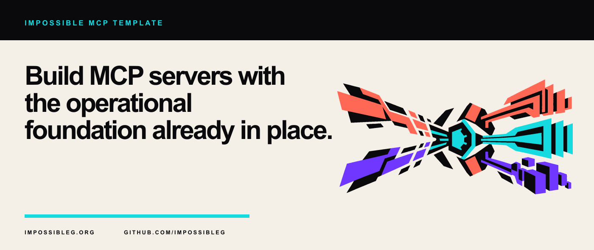

<p align="center">
  
</p>

# Impossible MCP Template

A TypeScript foundation for building Model Context Protocol servers that run locally over stdio or remotely over Streamable HTTP. Fork it, replace the example capabilities, and keep the operational pieces.

<p align="center">
  
</p>

## Included

- MCP tools, resources, prompts, and parameterized resources
- stdio and Streamable HTTP transports from one server factory
- health and readiness routes for HTTP deployments
- validated environment configuration and structured logs
- graceful process shutdown
- strict TypeScript, tests, coverage gates, linting, formatting, and CI
- Docker and Compose definitions
- security, contribution, and release documentation

## Start locally

```bash
npm install
cp .env.example .env
npm run dev
```

The default transport is stdio. Run the HTTP service with:

```bash
MCP_TRANSPORT=http npm run dev
```

On PowerShell:

```powershell
$env:MCP_TRANSPORT = "http"
npm run dev
```

The MCP endpoint is `http://127.0.0.1:3333/mcp`. Health checks are available at `/healthz` and `/readyz`.

## Connect over stdio

Build the project and point an MCP host at the executable:

```json
{
  "mcpServers": {
    "impossible-template": {
      "command": "node",
      "args": ["/absolute/path/to/impossible-mcp-template/dist/cli.js"]
    }
  }
}
```

## Make it yours

Start in [`src/server.ts`](src/server.ts). Replace the example `echo` and `server-time` tools, then update the resources and prompts. Keep application secrets in environment variables and add them to the logger's redaction paths.

The project separates transport wiring from capability registration. Tests can instantiate the server factory without opening a production port, and both transports expose the same behavior.

## Commands

| Command                 | Purpose                                      |
| ----------------------- | -------------------------------------------- |
| `npm run dev`           | Run the server with file watching            |
| `npm run build`         | Compile the production package               |
| `npm test`              | Run the test suite once                      |
| `npm run test:coverage` | Enforce coverage thresholds                  |
| `npm run lint`          | Check TypeScript and JavaScript rules        |
| `npm run format`        | Check repository formatting                  |
| `npm run verify`        | Run the complete local verification pipeline |

## Documentation

- [Architecture](docs/architecture.md)
- [Capabilities](docs/capabilities.md)
- [Configuration](docs/configuration.md)
- [Deployment](docs/deployment.md)
- [Operations](docs/operations.md)
- [Observability](docs/observability.md)
- [Security model](docs/security-model.md)
- [Testing](docs/testing.md)
- [Troubleshooting](docs/troubleshooting.md)

## License

[MIT](LICENSE)
